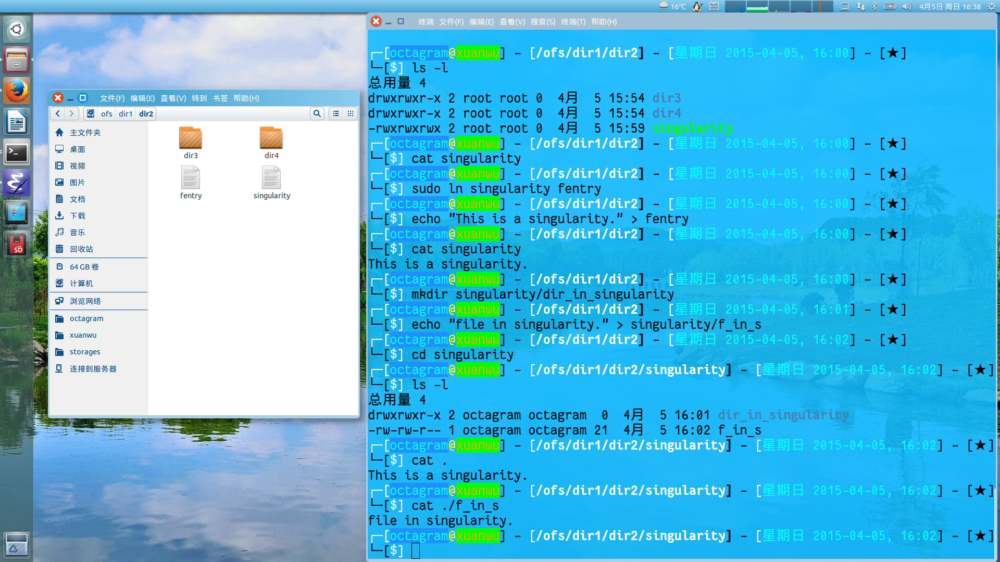

# ofs

=================

## 简介

ofs是一个怪异的内存文件系统。在ofs中，可以创建一种特殊的文件，叫做奇点。


如图所示，“singularity”是一个奇点。可以像操作普通文件一样，对它创建一个新的硬链接fentry；可以对它写入一句话“This is a singularity.”，可以读出这句话。但是它还可以作为一个文件夹来使用：创建子目录和文件，cd进去，ls列举文件夹内容，甚至可以通过“cat .”访问自己。

ofs提供一系列内核api用于创建文件、文件夹、符号链接、硬链接以及奇点。可以使用用户态的系统调用操作文件系统；也可以使用ofs提供的magic apis操作文件系统。奇点只能通过ofs magic apis创建。

ofs实际上是只是一种抽象的框架，它将一些系统调用封装成文件系统的接口（如open、read、write、ioctl等），应用程序通过这些系统调用可以进入到内核。如果针对这些系统调用的回调函数去定义不同的实现，就可以得到不同的功能。例如，如果实现的read、write、ioctl与一个硬件IO相关，那么此时ofs就可以当成一种驱动机制来使用（此时，奇点正好可以作为一个父设备，因为是设备，自然要能write、read或ioctl等；又因为是父设备，它还能当成一个文件夹容纳子设备。）。又如，如果通过mmap实现一些共享内存的方法，也许ofs还可以作为一种IPC机制来使用。

## 编译
```sh
    $ cd ofs
    $ source envsetup
    $ ofsa b
```

## 测试
```sh
    $ cd core
    $ sudo insmod ofs.ko
    $ cd ../utils/test/ko/ofstest.ko
    $ sudo insmod ofstest.ko
    $ sudo mount -t ofs -o uid=1000,magic ofstest /ofs # 如果没有/ofs需先创建或挂载到其他路径
```
可以在/ofs看到由ofs api创建出来的一系列文件、文件夹、符号链接、奇点。

ofstest.ko是一个使用ofs api的示例，源码位于ofs/utils/test/ko。
```c
static int __init ofs_test_init(void)
{
	...
	/* 注册一个“奇妙的”挂载 "ofstest" */
	ofs_root = ofs_register("ofstest");
	...

	/* 创建文件夹： /dir1 */
	rc = ofs_mkdir_magic(ofs_root, "dir1", 0775, OFS_NULL_OID, &d1mid);
	...

	/* 创建文件夹: /dir1/dir2 */
	rc = ofs_mkdir_magic(ofs_root, "dir2", 0775, d1mid, &d2mid);
	...

	/* 创建符号链接: /sym1 指向 /dir1/dir2 */
	rc = ofs_symlink_magic(ofs_root, "sym1", OFS_NULL_OID, d2mid, &s1mid);
	...

	/* 创建文件夹: /sym1/dir3 实际位置：/dir1/dir2/dir3 */
	rc = ofs_mkdir_magic(ofs_root, "dir3", 0775, s1mid, &d3mid);
	...

	/* 创建符号链接: /dir1/sym2 指向 /dir1/dir2/dir3 */
	rc = ofs_symlink_magic(ofs_root, "sym2", d1mid, d3mid, &s2mid);
	...

	/* 创建**奇点**: /sym1/singularity 实际位置：/dir1/dir2/singularity */
	rc = ofs_create_magic(ofs_root, "singularity", 0777,
			      true, s1mid, &f1mid);
	...

	/* 创建普通文件: /dir1/sym2/regfile 实际位置：/dir1/dir2/dir3/regfile */
	rc = ofs_create_magic(ofs_root, "regfile", 0775,
			      false, s2mid, &f2mid);
	...

	/* entry: /sym1/dir4 实际位置： /dir1/dir2/dir4 */
	rc = ofs_mkdir_magic(ofs_root, "dir4", 0775, s1mid, &d4mid);
	...
}

static void __exit ofs_test_exit(void)
{
	...
	/* 递归删除 /dir1 */
	rc = ofs_rm_magic(ofs_root, d1mid, true);
	...

	/* 注销 */
	ofs_unregister(ofs_root);
}
```

## ofs
在内核内部，ofs不使用字符串查找路径。每个ofs inode都有一个唯一的id，类型为oid_t。ofs可以通过oid_t查找到对应的ofs inode。但是并不是所有的ofs inode都能通过oid_t查找到。

1. 通过用户态系统调用，如mkdir()、mknod()、symlink()、creat()等（或命令mkdir、mknod、ln -s、touch等）创建的结点属于普通结点。普通结点只能通过字符串路径查找。

2. ofs提供一系列以_magic结尾的apis，通过这些magic apis创建出的结点被称为magic ofs inode。在内核中可以通过oid_t查找magic ofs inode。oid_t其实就是inode number，可以通过`ls -i`获取。

3. ofs内部使用散列表+红黑树组织所有的magic ofs inode，查找时通过唯一的oid_t计算出树根在散列表的位置，然后从红黑树中查找到ofs inode。未来还会考虑使用基数树来代替散列表+红黑树的方式。

4. ofs magic apis所创建出的dentry（拥有参数name）被称为magic dentry，用户态的系统调用是无法删除magic dentry（这个操作在VFS通常被称为drop）。只能通过ofs magic apis才能删除magic dentry。

5. magic api只能在注册过的文件系统中使用。ofs_register只需要一个字符串参数，称为magic string。当注册成功，这个函数会返回一个struct ofs_root指针，所有的ofs magic apis都需要这个指针作为第一个参数。

6. 当退出时，不要忘记使用ofs_unregister来做一些清理工作。

7. 可以使用mount命令将文件系统显示到用户空间。

```sh
mount -t ofs -o uid=1000,gid=1000,magic "magic string" /mountpoint
```

-o选项中需带有"magic"，表明是一次magic mount，而“magic string”需要和传递给ofs_register的参数一致。ofs使用“magic string”识别文件系统。

## ofs的挂载
1. ofs的挂载分为三种：

- kernel internal mount: ofs_register()实际上是将文件系统挂载到内核内部，只有文件系统在内核中挂载了，才可以使用ofs magic apis操作它。

- userspace magic mount: 在mount命令的`-o'选项中指定了magic，并且需要传递“magic string”表明需要将哪个ofs导出到用户空间来。

- userspace normal mount: 没有指定magic选项，“magic string”被忽略，但为了满足mount命令的语法，“magic string”不能为空，此时文件系统只能像tmpfs一样使用系统调用创建普通文件系统结点。

2. 挂载选项

- uid=%u: 根目录的uid

- gid=%u: 根目录的gid

- mode=%o: 根目录的权限，例如mode=0775，表示属主和属组拥有读写执行权限，而其他用户拥有读和执行权限

- magic: 表明是magic mount

## ofs magic inode
ofs magic inode是由ofs magic apis创建的文件系统结点，它的文件名（由magic apis的参数name指定）被称为magic dentry。

magic dentry是唯一的，并且不能被用户态的系统调用drop，只能通过magic apis的删除函数drop。

用户态的系统调用能对ofs magic inode创建其他硬链接，当存在其他硬链接时，即使是magic apis也无法drop magic dentry。

## 奇点
奇点是一种特殊的regular file，它的inode拥有S_IFREG属性，但是它的magic dentry却拥有属性DCACHE_DIRECTORY_TYPE。

通过magic dentry，奇点可以当成一个文件夹来使用。当重新为奇点创建一个硬链接，这个dentry拥有属性DCACHE_FILE_TYPE，因此通过这个dentry可以将奇点当成普通文件使用。

## ofs apis简介

### 注册
```c
struct ofs_root *ofs_register(char *magic);
```
- 参数<br>
magic: ofs识别magic mount的唯一字符串；
- 返回<br>
struct ofs_root指针，ofs magic apis需要它作为第一个参数，表明操作的文件系统；<br>
或则失败时为错误码<br>
errno，可以参考下面两个文件获得错误码的含义<br>
**/usr/include/asm-generic/errno-base.h**<br>
**/usr/include/asm-generic/errno.h**<br>

### 注销
```c
int ofs_unregister(struct ofs_root *root);
```
- 参数<br>
root: 需要注销的文件系统；<br>
- 返回<br>
errno，可以参考下面两个文件获得错误码的含义<br>
**/usr/include/asm-generic/errno-base.h**<br>
**/usr/include/asm-generic/errno.h**<br>

### 创建文件夹
```c
int ofs_mkdir_magic(struct ofs_root *root, const char *name, umode_t mode,
                    oid_t folder, oid_t *result);
```
- 参数<br>
root: 注册过的文件系统；<br>
name: 文件夹名字；<br>
mode: 文件夹权限，填0表示默认值0775；<br>
folder: 父文件夹，必须是一个magic ofs inode。可以是一个目录，也可以是一个奇点。OFS_NULL_OID表示根目录；<br>
result: 如果创建成功，将通过result指向的buffer返回新目录的oid_t；
- 返回值<br>
0: 成功，*result的值有效<br>
errno: 失败，*result的值无效，错误码<br>
**/usr/include/asm-generic/errno-base.h**<br>
**/usr/include/asm-generic/errno.h**<br>

### 创建符号链接
```c
int ofs_symlink_magic(struct ofs_root *root, const char *name, oid_t folder,
                      oid_t target, oid_t *result);
```
- 参数<br>
root: 注册过的文件系统；<br>
name: 软链接名字；<br>
folder: 父文件夹，必须是一个magic ofs inode。可以是一个目录，也可以是一个奇点。OFS_NULL_OID表示根目录；<br>
target: 链接的目标，必须是一个magic ofs inode，函数会自动计算出链接字符串；<br>
result: 如果创建成功，将通过result指向的buffer返回所创建的符号链接的oid_t；<br>
- 返回值<br>
0: 成功，*result的值有效；<br>
errno: 失败，*result的值无效，错误码<br>
**/usr/include/asm-generic/errno-base.h**<br>
**/usr/include/asm-generic/errno.h**<br>

### 创建普通文件(regular file)或奇点
```c
int ofs_create_magic(struct ofs_root *root, const char *name, umode_t mode,
                     bool is_singularity, oid_t folder, oid_t *result);
```
- 参数<br>
root: 注册过的文件系统；<br>
name: 名字；<br>
mode: 权限，填0表示默认值0775；<br>
is_singularity: true表示创建奇点，false表示创建普通文件；<br>
folder: 父文件夹，必须是一个magic ofs inode。可以是一个目录，也可以是一个奇点。OFS_NULL_OID表示根目录；<br>
result: 如果创建成功，将通过result指向的buffer返回所创建的新结点的oid_t；<br>
- 返回值<br>
0: 成功，*result的值有效；<br>
errno: 失败，*result的值无效，错误码<br>
**/usr/include/asm-generic/errno-base.h**<br>
**/usr/include/asm-generic/errno.h**<br>

### 删除一个空文件夹
```c
int ofs_rmdir_magic(struct ofs_root *root, oid_t target);
```
- 参数<br>
root: 注册过的文件系统；<br>
target: 需要删除的文件夹的oid_t；<br>
- 返回值<br>
0: 成功，*result的值有效；<br>
errno: 失败，*result的值无效，错误码<br>
**/usr/include/asm-generic/errno-base.h**<br>
**/usr/include/asm-generic/errno.h**<br>

### 删除ofs magic inode的magic dentry
```c
int ofs_unlink_magic(struct ofs_root *root, oid_t target);
```
- 参数<br>
root: 注册过的文件系统；<br>
target: 需要unlink的oid_t；<br>
- 返回值<br>
0: 成功，*result的值有效；<br>
errno: 失败，*result的值无效，错误码<br>
**/usr/include/asm-generic/errno-base.h**<br>
**/usr/include/asm-generic/errno.h**<br>
- 注释
* 如果magic ofs inode拥有其他硬链接是无法unlink magic dentry的。

### 删除一个奇点
```c
int ofs_rm_singularity(struct ofs_root *root, oid_t target);
```
- 参数<br>
root: 注册过的文件系统；<br>
target: 需要删除的奇点的oid_t；<br>
- 返回值<br>
0: 成功，*result的值有效；<br>
errno: 失败，*result的值无效，错误码<br>
**/usr/include/asm-generic/errno-base.h**<br>
**/usr/include/asm-generic/errno.h**<br>
- 注释
* 如果奇点拥有其他硬链接是无法unlink magic dentry的。

### 删除
```c
int ofs_rm_magic(struct ofs_root *root, oid_t target, bool r);
```
- 参数<br>
root: 注册过的文件系统；<br>
target: 需要删除的oid_t；<br>
r: true表示递归删除；<br>
- 返回值<br>
0: 成功，*result的值有效；<br>
errno: 失败，*result的值无效，错误码<br>
**/usr/include/asm-generic/errno-base.h**<br>
**/usr/include/asm-generic/errno.h**<br>
- 注释<br>
* 如果r为false，类似于`rm`命令；如果r为true，递归删除结点，类似`rm -r`命令。<br>

### 移动ofs magic inode
```c
int ofs_rename_magic(struct ofs_root *root, oid_t target, oid_t newfdr,
                     const char *newname, unsigned int flags);
```
- 参数<br>
root: 注册过的文件系统；<br>
target: 需要移动的目标；<br>
newfdr: 新文件夹；<br>
newname: 新名字（magic dentry）；<br>
flags: rename flags，取值RENAME_EXCHANGE，参考man renameat2；<br>
- 返回值<br>
0: 创建成功，*result的值有效；<br>
errno: 失败，*result的值无效，错误码<br>
**/usr/include/asm-generic/errno-base.h**<br>
**/usr/include/asm-generic/errno.h**<br>

## debug接口
当magic ofs注册后，得到一个debug的接口：
> /sys/kernel/debug/ofs/"magic string"/apis

可以通过echo命令写入特定格式的字符串调用magic apis

### ofs_mkdir_magic
命令格式：
```sh
echo -e "name=%s,folder=%u,mode=%o\0" > ofs_mkdir_magic
```

ofs_mkdir_magic()的root和result参数由内部自动提供，root指向"magic string"代表的文件系统，当创建成功后，result的值可以通过`cat ofs_mkdir_magic`获取。字符串各个字段的顺序可以任意。

例如
```sh
echo -e "name=foo,folder=0,mode=0777\0" > ofs_mkdir_magic
```

将在根目录创建一个名为foo的文件夹。
`cat ofs_mkdir_magic`将得到foo的oid_t。

### ofs_symlink_magic
命令格式：
```sh
echo -e "name=%s,folder=%u,target=%u\0" > ofs_symlink_magic
```

target表示软链接的目标。

### ofs_create_magic
命令格式：
```sh
echo -e "name=%s,folder=%u,mode=%o,-s\0" > ofs_create_magic
```

当有-s时表示创建singularity。

### ofs_rmdir_magic
命令格式：
```sh
echo -e "target=%u\0" > ofs_rmdir_magic
```

### ofs_unlink_magic
命令格式：
```sh
echo -e "target=%u\0" > ofs_unlink_magic
```

### ofs_rm_singularity
命令格式：
```sh
echo -e "target=%u\0" > ofs_rm_singularity
```

### ofs_rm_magic
命令格式：
```sh
echo -e "target=%u\0" > ofs_rm_magic
```

### ofs_rename_magic
命令格式：
```sh
echo -e "target=%u,folder=%u,name=%s,flags=%u\0" > ofs_rename_magic
```

